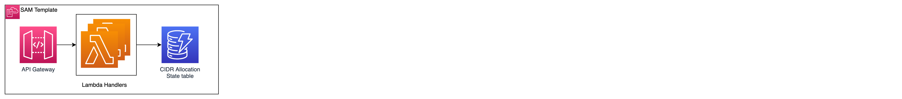
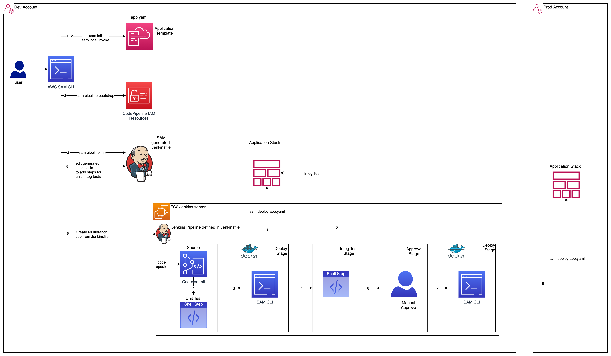
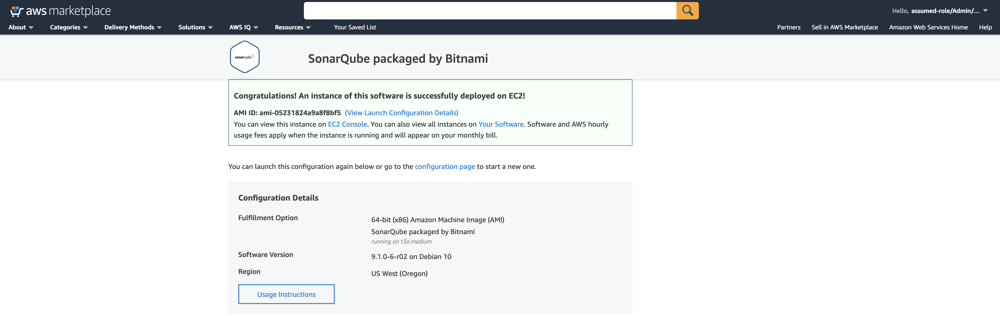
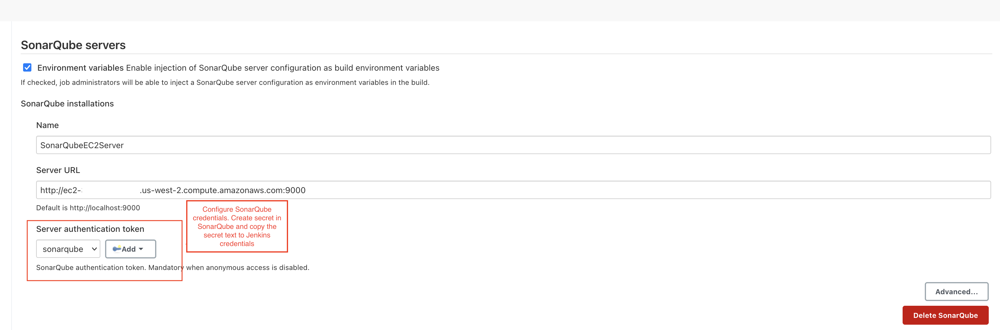
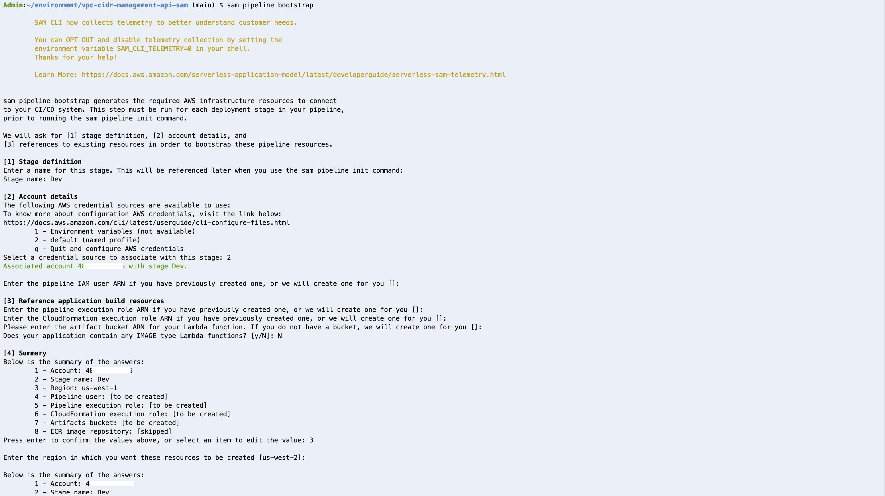
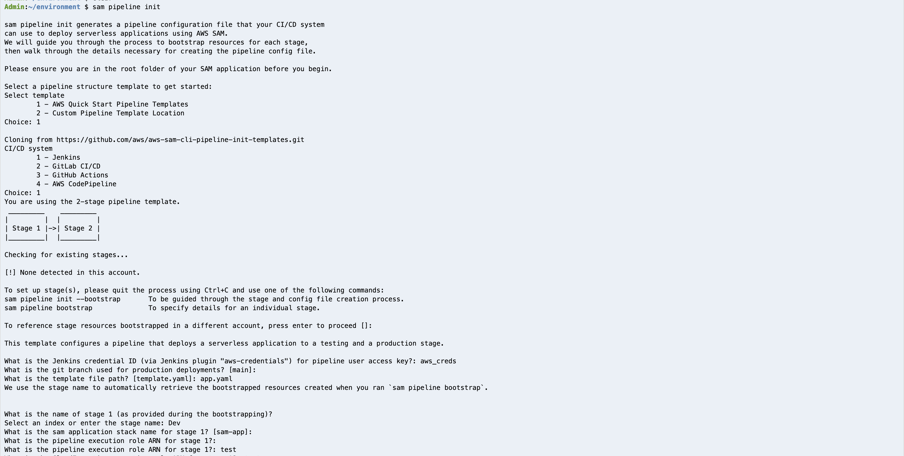
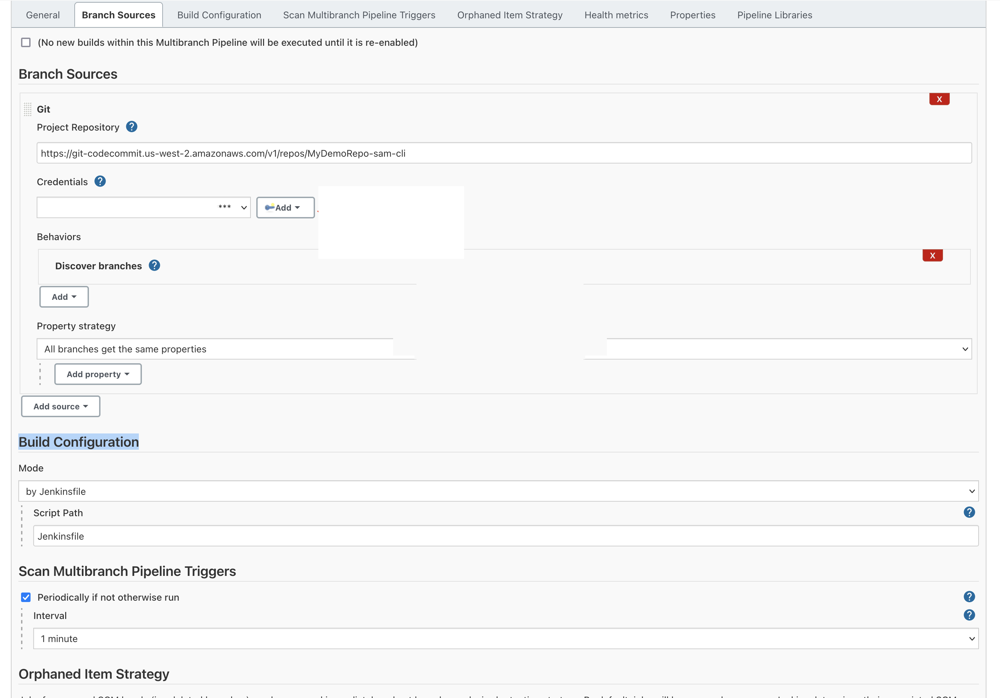
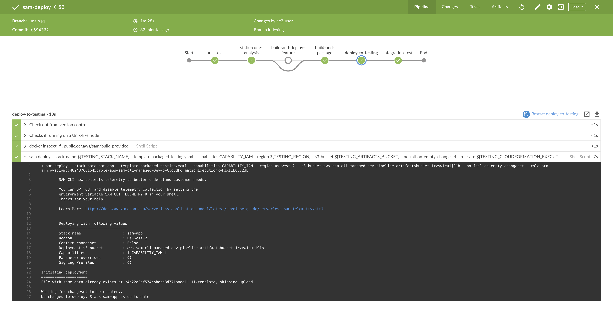
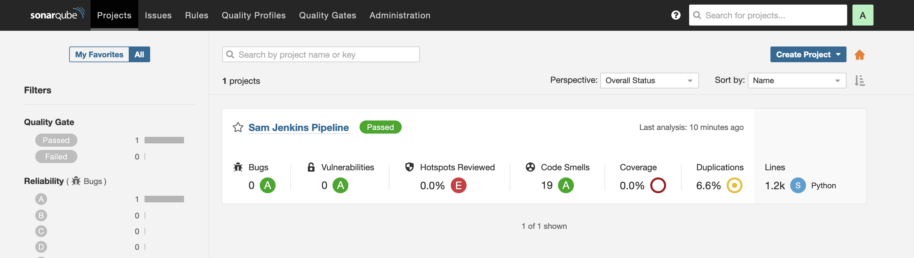

# CI/CD of Serverless API using SAM CLI generated Jenkins pipeline

This project uses the SAM CLI to generate a Jenkins pipeline to manage the CI/CD of a Serverless API.
SAM CLI commands - 'sam pipeline bootstrap' and 'sam pipeline init' are used to generate a cookie-cutter pipeline and the necessary iam resources.
The generated Jenkins pipeline(Jenkinsfile) can be edited to add/configure the required stages, and add additional pipeline steps.
A pre-configured Jenkinsfile (with pipeline steps for unit-tests, (optional)SonarQube code-scan, integration-tests), and steps to deploy the pipeline are provided below. 


## Product Versions
* AWS SAM CLI - used for local development, build, package and deploy the API
* Python Behave 1.2.6 BDD framework - Integration tests to validate the API deployment
* AWS SDK for Python (Boto3) V1.18
* Jenkins 2.303
* (Optional) SonarQube - Bitnami AMI (ami-05231824a9a8f8bf5)
* Python 3.7

## Directory structure
```
├── README.md                                     <-- This documentation file
├── cidr_management                               <-- Source code for Lambda functions
├── cidr_management/config                        <-- Env config variables
├── cidr_management/utils                         <-- Functions shared by multiple Lambdas
├── app.yaml                                      <-- SAM Template for the app to be deployed
├── samconfig.toml                                <-- SAM config file, contains config vars for the app and pipeline
├── cidr_management/requirements.txt              <-- Python dependencies
├── sonar-project.properties                      <-- SonarQube config (Optional)
└── Jenkinsfile                                   <-- pre-configured Jenkins pipeline
```

## Architecture

Cidr API deployed using SAM CLI. 
The OpenAPI doc for this API is located at [docs/openapi3.yml](docs/openapi3.yml)



CI/CD of Cidr API using SAM CLI generated Jenkins pipeline


## Pre-requisites
    * AWS Cloud9 IDE 
    * Install Python3.7
    * Install AWS SAM-CLI
    * (Optional)Get S3 bucket name, if you would like to re-use an existing bucket for SAM CLI artifacts
    * SonarQube-scan is an optional step in the pipeline, user has to uncomment the step in the Jenkinsfile


## Setup CodeCommit repository
```shell
# Configure AWS named profile for the required {account,region} environment
aws configure --profile default

#Create CodeCommit repo
aws codecommit create-repository --repository-name MyDemoRepo-Sam-Cli

#Create HTTPS Git credentials for CodeCommit
#Add remote 
git remote add codecommit https://git-codecommit.us-west-2.amazonaws.com/v1/repos/MyDemoRepo-Sam-Cli

#Push to git
git push codecommit main
```

## Local env setup, unit tests
```shell
python3 -m pip install --user --upgrade pip
python3 -m venv env
source env/bin/activate

#Install dependencies
pip install -r cidr_management/requirements.txt

# Run Unit tests
pytest ./

```

## Install Jenkins on Cloud9 EC2 instance
```shell
sudo yum update –y

# Add the Jenkins repo using the following command:

sudo wget -O /etc/yum.repos.d/jenkins.repo \
    https://pkg.jenkins.io/redhat-stable/jenkins.repo

# Import a key file from Jenkins-CI to enable installation from the package:

sudo rpm --import https://pkg.jenkins.io/redhat-stable/jenkins.io.key
sudo yum upgrade

#Install Jenkins:
sudo yum install jenkins java-1.8.0-openjdk-devel -y
sudo systemctl daemon-reload

# Start Jenkins as a service:

sudo systemctl start jenkins

# Check the status of the Jenkins service
sudo systemctl status jenkins

# Jenkins runs on port 8080 on the Cloud9 instance. From a local browser, open the Cloud9 preview url -  https://8bb.vfs.cloud9.us-west-2.amazonaws.com/
# The initial admin credentials will be availabe at /var/lib/jenkins/secrets/initialPassword
# Ensure plugins are installed - Docker, Docker Pipeline, Pipeline Steps, Cloudbees AWS Credentials
# Configure Jenkins credentials from AWS Credentials of IAM User. These will be used by Jenkins pipeline steps
# Allow Jenkins server read permissions on /var/run/docker.sock to use docker service for dind steps in Jenkins pipeline

```

## (Optional) Install SonarQube Scanner on Cloud9 EC2 instance
SonarQube is licensed under LGPL-3.0. This step, and following two steps are optional.
```shell
wget https://binaries.sonarsource.com/Distribution/sonar-scanner-cli/sonar-scanner-cli-4.6.2.2472-linux.zip -P /tmp
unzip /tmp/sonar-scanner-cli-4.6.2.2472-linux.zip
cp sonar-scanner-4.6.2.2472-linux sonar-scanner
ln -sf /home/ec2-user/environment/sonar-scanner/bin/sonar-scanner /usr/bin/sonar-scanner
```

## (Optional) Start SonarQube server on EC2
For this sample, a SonarQube server on EC2 is started using an AMI from AWS Marketplace


## (Optional) Integrate Jenkins with SonarQube
Un-comment the 'static-code-analysis' stage in Jenkinsfile to add the SonarQube-scan step 
Configure the SonarQube server url and SonarQube access credentials in Jenkins



## CI/CD with SAM CLI generated Jenkins Pipeline
* ### Run 'sam pipeline bootstrap' - This sets up IAM roles required for the pipeline 

```
# Sam pipeline bootstrap to create required iam roles
# Create a single stage named 'Dev', use us-west-2, create a new bucket, use default profile
# For this demo only 1 stage is required. For cross-account deploy, create another stage named 'Prod' with respective params
sam pipeline bootstrap
```
* ### Example output of 'sam pipeline bootstrap'. 
  For this demo, only one stage 'Dev' is required.
  Note the bucket name created in the end 'Summary'. Update samconfig.toml with the bucket name



* ### Run 'sam pipeline init' - This generates the Jenkinsfile
```shell 
# sam pipeline init  - To generate a Jenkins pipeline in Jenkinsfile
# The below command will generate a Jenkinsfile containing a 2-stage pipeline. For this demo, provide 'Dev' as both the 1st and 2nd stage.
sam pipeline init
```
* ### Example output of 'sam pipeline init'. 


A pre-configured Jenkinsfile is provided in this repository, which contains the Unit-Test, (Optional) Static code-scan and Integration Test steps.

## Create Jenkins Multibranch Job. Set Branch Sources = Git, Build Configuration = Jenkinsfile



## Start Pipeline Execution
Trigger the pipeline execution from Jenkins console

<br/>

## (Optional) From the SonarQube Console, verify Scan results for the project



## License

This library is licensed under the MIT-0 License. See the LICENSE file.

SonarQube is licensed under LGPL-3.0. 
